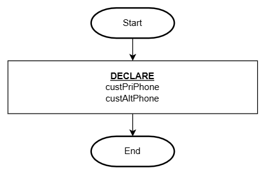
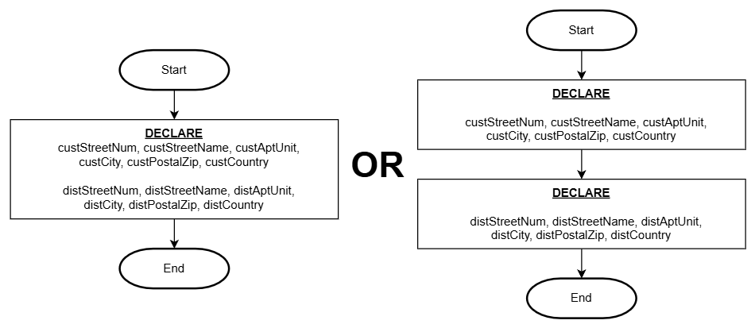
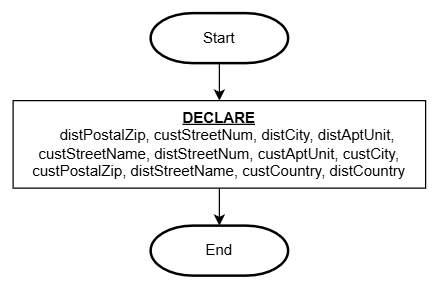

# Variables

## Overview

As introduced in the Computational Thinking: Data Representation section ([Data Representation](./computational-thinking.md#data-representation)), variables are named placeholders which can be referred to within the solution to access specific information by name to refer to a value.

Variables are critical in providing our solutions the ability to not just store, but use information to help determine logical pathways ([selection](./logic-selection.md) which is covered later). Information can be simple and straight forward, but it can also be very complex. The more complex data representation will be covered much later on in these notes, but in this section we'll concentrate on simple data representation and how variables are used in both flowchart and pseudo code methods of documentation.

Many programming languages are "typed" in that you must indicate the type of information the variable must represent (example: whole number, fractional number, characters etc.), but not all languages require this extra level of detail. Sticking with our "language agnostic" theme, we will not be including type information when we declare and use variables.

## Terminology

| Term           | Meaning                                                       |
| -------------- | ------------------------------------------------------------- |
| **IDENTIFIER** | The **name** of the variable.                                 |
| **DECLARE**    | To **create** a variable which will include the IDENTIFIER.   |
| **ASSIGN**     | To **store a value** to a variable.                           |
| **INITIALIZE** | To both DECLARE and ASSIGN a value to a variable in one step. |

## Variable Identifiers (name)

Variable identifiers should be well though out and purposefully named to best describe the information it will be representing. It is important to carry this through into your actual programming as well! Providing meaningful names to your variables will contribute towards easier to read and manage logic (or code). However, we need to be mindful of efficiency as we don't want to be referring to very long names (and in the case of programming code, we don't want to be typing them either!), so we try to use a style of shorthand to shorten the names enough without losing the context.

For instance, if we need to represent information about a customer's primary phone number and an alternate phone number, we wouldn't want to be too descriptive:

```
DECLARE:
    customerPrimaryPhoneNumber
    customerAlternatePhoneNumber
```

We would instead shorten the words to abbreviations but not to the point where we still can't understand what they are:

**Pseudo Code**

```
1. DECLARE:
    custPriPhone
    custAltPhone

2. End
```

**Flowchart**



As you immerse yourself in this industry, you will continue to learn of typical shorthand naming conventions to represent typical types of information. You will be better in time and practice!

Something you may have noticed is the use of upper and lower case characters to help discern between words. This is a common naming practice ("lower camel case" - [wikipedia](https://en.wikipedia.org/wiki/Camel_case)) in programming which we will be applying in these notes as well.

## Organization

Sometimes we need to manage a lot of information which can lead to the use of many variables. It is a standard practice to group all the variables you will need using a combination of lines and line-spacing to help readers find variables and helps to see if you have covered all the data you will need representation for.

Scenario: A solution needs to represent address information for a customer and a distributor. How would you breakdown this information into appropriate variables?

**Pseudo Code**

```
1. DECLARE:
    custStreetNum, custStreetName, custAptUnit, custCity, custPostalZip, custCountry
    distStreetNum, distStreetName, distAptUnit, distCity, distPostalZip, distCountry

2. End
```

**Flowchart**



These variables are grouped by customer then by distributor and separating these two independent groups with a line break. Organizing the variables like this makes it super easy to find and confirm the data representation for each key piece of information.

:::danger DON'T DO THIS
What you don't want to do is declare every variable on a single line in random order! This is very confusing and benefits nobody:

**Pseudo Code**

```
1. DECLARE:
    distPostalZip, custStreetNum, distCity, distAptUnit, custStreetName, distStreetNum, custAptUnit, custCity, custPostalZip, distStreetName, custCountry, distCountry

2. End
```

**Flowchart**



:::
